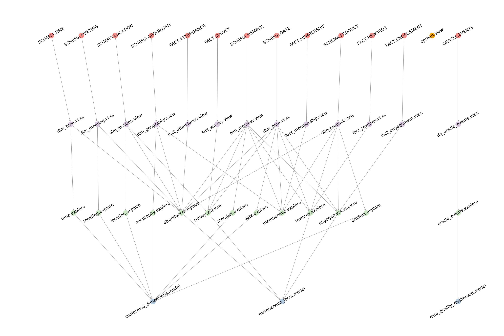

# LookML Grapher

As part of this tool suite, we include a LookML grapher--a tool that shows a "network diagram" of the `model - explore - view - table` relationships. The code will also identify any `orphans` i.e. views not referenced by any models or explores.

For instance, in this output diagram



where the nodes are colored as follows:

- *models*: blue
- *explores*: green
- *views*: purple
- *orphans*: orange
- *tables*: red,

we can see that the `membership_facts` model has 5 explores. The first explore (`engagement`) references 4 views: `fact_engagement`, `dim_product`, `dim_date`, and `dim_member`. We can also see that there is one orphaned view (called `orphan` in this fake example).

## Configuration
To run the grapher, run

```
	python run_grapher.py --config config/grapher/config_grapher.json
```

where the config file has the following fields:

```
{
    "infile_globs": [
        "../somerepo/*.lkml"
    ],

    "output": "graph.png",

    "options": {
        "node_size": 500,
        "label_font_size": 18,
        "text_angle": 30,
        "image_width": 24,
        "image_height" : 16,
        "title": "My Amazing LookML"
    }
}
```
Options, are, as you might suspect, optional.

## Limitations
While this tool might create a network diagram for any valid `lkml` input repo, it is not guaranteed to be understandable or useful. YMMV. As the network gets large, overplotting of nodes can occur and makes them unreadable. Or, if your LookML is a mess and bunch of views and no models there won't be any structure to see. 

You may be able to fix some of these visualiztion issues by narrowing the file globs or you many need to modify the font size or image size. That is, the `node_size` and `label_font_size` are absolute, not relative, sizes. Thus, if you increase the `image_width` and/or `image_height`, you create a larger canvas and more space for the nodes.

For instance, you can change this overplotted image:


to this more spaced out one:


just by increasing `image_width`.

## Animation

I thought that it could be fun to see a repository over time. Thus, `lookml-tools` includes the ability to create an animated gif.


To do this, you will need a normal grapher config file, such as

```
{
    "infile_globs": [
        "../somerepo/*.lkml"
    ],

    "options": {
        "node_size": 500,
        "label_font_size": 18,
        "text_angle": 30,
        "image_width": 24,
        "image_height" : 16
    }
}
```
(The `output` field is not required here.)

Then, you run:

```
    python run_graph_animator.py 
        --config config.json 
        --path_to_repo  ../somerepo 
        --image_directory myimages 
        --gif_filename movie.gif
```

It will create a set of images, one per commmit, in the `image_directory` (creating this directory if it does not exist) and output a GIF to `gif_filename`.

Note, if your `image_width` and `image_height` are large, creating the GIF will take some time (many minutes) and the file can be large (GBs rather than MBs).
